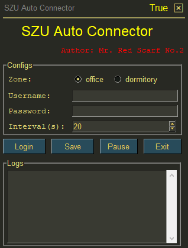

# SZU Auto Connect


[](https://pypi.python.org/pypi/szu-autoconnect/)

# 起源

垃圾深大校园网, 最近一天能掉线一万次, 这个脚本可以帮助你一直保持在线状态. 也可用用于服务器的正常上网.

# 安装和运行

## 下载 exe 文件运行

前往 [Release](https://github.com/ackness/szu-autoconnect/releases) 下载所有版本, 或者 [点击直接下载V1.0.0](https://github.com/ackness/szu-autoconnect/releases/download/v1.0.0/SZU-AutoConnect-V1.0.0.exe
).

## 从 pip 安装与运行 

`如果你不需要重写功能或者定制其他功能, 推荐这个方式运行`

安装

```bash
pip install szu-autoconnect
```

## 运行

### 使用 ui 界面

界面截图



```bash
python -m szu-autoconnect.run -ui
```

### 使用命令行

```bash
python -m szu-autoconnect.run -u username -p password
```

### 参数帮助

```bash
python -m szu-autoconnect.run --help
```

## 从源码运行

### 安装

```bash
git clone https://github.com/ackness/szu-autoconnect.git

cd szu-autoconnect/szu-autoconnect
```

### 基本环境
1. `python >= 3.6`, 2021年了最好是 3.9 
2. 安装 `requirement.txt` 里面的库, `pip install -r requirement.txt`
3. `内网`环境
4. `正确的账号密码` 和 `未欠费的套餐`

### 用法

#### 使用 ui 界面

```bash
python run.py -ui
```

#### 使用命令行

```bash
python run.py -u username -p password
```

#### 额外参数

```
usage: SZU Auto Reconnect [-h] [--username USERNAME] [--password PASSWORD] [--zone {office,dormitory}] [--interval INTERVAL] [--use_ui]

optional arguments:
  -h, --help            show this help message and exit
  --username USERNAME, -u USERNAME
                        your username
  --password PASSWORD, -p PASSWORD
                        your password
  --zone {office,dormitory}, -z {office,dormitory}
                        which zone
  --interval INTERVAL, -i INTERVAL
                        time interval to check connection status
  --use_ui, -ui         whether to use UI

```

#### 打包

```
python -m pysimplegui-exemaker.pysimplegui-exemaker

选择 only_ui.py 文件, 进行打包
```

# 原理

使用构造`POST 表单`完成上网请求, 和直接在网页端登录是一样的.


# 前人的肩膀

相较于 [AutoConnect](https://github.com/LinusWu/AutoConnect), 改进的地方如下:

1. 使用 apscheduler 进行任务调度
2. 使用 socket 判断是否联网
3. 使用 loguru 记录日志
4. 增加宿舍区上网功能
5. 增加 ui, 可以替代垃圾 Drcom


# 申明

1. 禁止用此脚本干扰他人正常上网
2. 本脚本使用构造POST表单完成上网请求, 完全安全可信
3. 本脚本导致上网账号被封禁概不负责 
4. 明文密码可能导致您的账号密码泄露
5. 如果你发现脚本用不了了, 可能是学校更改了上网方式, 或者纯粹是我懒得更新

# Reference

1. [AutoConnect](https://github.com/LinusWu/AutoConnect)
